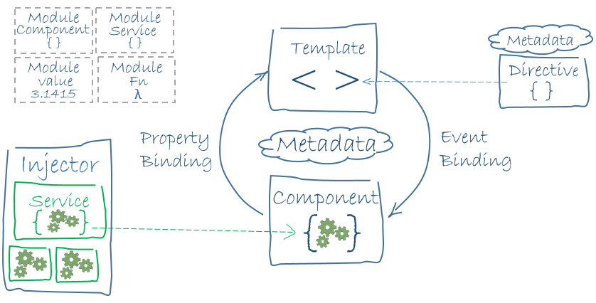

<h1 align="center">Aplicacion Front-End del Catálogo Digital  de la Librería</h1>
<p align="center"> Logo e imagen o gif de la interfaz principal de la herramienta</p>
<p align="center"></p> 


## Tabla de contenidos:

---

- [Descripción y contexto](#descripción-y-contexto)
- [Guía de instalación](#guía-de-instalación)
- [Autor/es](#autores)
- [Información adicional](#información-adicional)

## Descripción y contexto
---

Siguiendo con la arquitectura cliente-servidor, esta aplicación tiene como objetivo efectuar peticiones a la aplicación de backend para capturar las respuestas del backend y mostrarla al usuario. De este modo la aplicacion de Front-End actuaría a modo de cliente mientras que la aplicación de Back-End actuaría como servidor.

Las aplicacione hechas con Angular se basan en tres pilares fundamentales: Tempplate, Component, Service. El template representa tanto el continente y el contenido que se le presenta al usuario final. Cada sección del contenido de la aplicacion (catálogo, registro, inicio de sesión...) se modela mediante un componente, cada uno de estos componentes son renderizados en la misma pagina en función de la interactuación del cliente. 

Cada uno de los componentes lleva asociada un fichero css para estilizar el contenido del componente, un fichero html que define la estructura de la información del componente, y un fichero typescript encargado de encapsular el tratamiento de la interactiuación con el ususario.

Para facillitar el tratamiento de la ionteractuación con el usuario, es recomendable separarar la realización de consulatas al Back-End con el manejo de dichas consultas, para ello se usan los Services. Un Service es un módulo de la aplicación que se encarga de recoger la lógica necesaria para interactiuar con el Back-End, de esta forma los "Component" solo se han de encargar de presentar el resulado de dichas interactuaciones.





## Guía de instalación
---

En primer lugar es necesario instlar [versiones compatibles](https://angular.io/cli) de [Angular CLI](https://angular.io/cli) y [NodeJS](https://nodejs.org/en/download/)). Se aconseja usar la siguiente configuración para evitar error e incompatibilidades:

```sh { background=true }
❯ ng version


     _                      _                 ____ _     ___
    / \   _ __   __ _ _   _| | __ _ _ __     / ___| |   |_ _|
   / △ \ | '_ \ / _` | | | | |/ _` | '__|   | |   | |    | |
  / ___ \| | | | (_| | |_| | | (_| | |      | |___| |___ | |
 /_/   \_\_| |_|\__, |\__,_|_|\__,_|_|       \____|_____|___|
                |___/
    

Angular CLI: 15.1.1
Node: 18.10.0
Package Manager: npm 8.19.2
OS: linux x64

Angular: 15.1.1
... animations, cli, common, compiler, compiler-cli, core, forms
... platform-browser, platform-browser-dynamic, router

Package                         Version
---------------------------------------------------------
@angular-devkit/architect       0.1501.1
@angular-devkit/build-angular   15.1.1
@angular-devkit/core            15.1.1
@angular-devkit/schematics      15.1.1
@schematics/angular             15.1.1
rxjs                            7.8.0
typescript                      4.9.4
```

Una vez se tienen las versiones correctas de las librerías y dependencias del entorno basta con ejecutar el siguiente comando `ng serve` para compilar y desplegar el proyecto:

```sh {background=true}
ng version
```

```sh { background=true }
❯ ng serve
✔ Browser application bundle generation complete.

Initial Chunk Files   | Names         |  Raw Size
vendor.js             | vendor        |   2.42 MB | 
polyfills.js          | polyfills     | 314.29 kB | 
styles.css, styles.js | styles        | 211.01 kB | 
main.js               | main          | 145.19 kB | 
runtime.js            | runtime       |   6.53 kB | 

                      | Initial Total |   3.08 MB

Build at: 2023-01-23T16:52:53.188Z - Hash: dc98a05c8957615c - Time: 3331ms

** Angular Live Development Server is listening on localhost:4200, open your browser on http://localhost:4200/ **


✔ Compiled successfully.
```

Como viene siendo habitual en las aplicaciones de Angular, la aplicación se alojará por defecto en la siguiente URL `http://localhost:4200`, y se recargará de forma automática segun se salven los cambios en el proyecto.

También es posible compilar de forma manual el proyecto para generar los artefactos para el despliegue con `ng build`, los artefactos serán almacenados en el directorio `dist/`.

## Autor/es

---

Nombra a el/los autor/es original/es. Consulta con ellos antes de publicar un email o un nombre personal. Una manera muy común es dirigirlos a sus cuentas de redes sociales.

## Información adicional

---

Esta es la sección que permite agregar más información de contexto al proyecto como alguna web de relevancia, proyectos similares o que hayan usado la misma tecnología.
